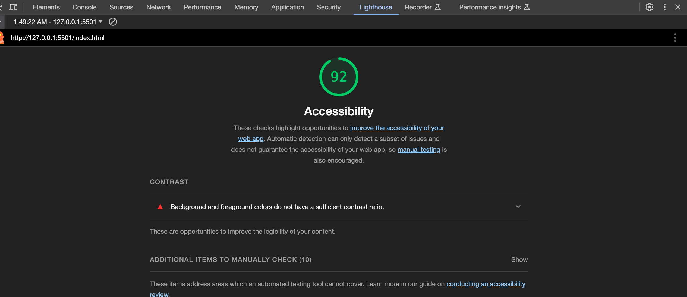

# LAB - Class-08b

11.1.23

## Salmon Cookies

I've created a dynamic webpage for Pat's cookies. A large component of this assignment required me to write JS code to establish a class to model store locations, generates sales data for each location, dynamically builds an HTML table with the specified header and footer, and populates the table with the sales data rows for each store. And now it features a revolving photo carousel.

### Author: Stephanie G Johnson

### Links and Resources

[SOLID](https://www.geeksforgeeks.org/single-responsibility-in-solid-design-principle/)

[Working with Objects](https://developer.mozilla.org/en-US/docs/Web/JavaScript/Guide/Working_with_objects)

[HTML table w/ JS and DOM Interface](https://developer.mozilla.org/en-US/docs/Web/API/Document_Object_Model/Traversing_an_HTML_table_with_JavaScript_and_DOM_Interfaces#creating_an_html_table_dynamically)

[Carousel](https://css-tricks.com/css-only-carousel/)

[submission PR](https://stepheegee.github.io/cookie-stand/)

### Lighthouse Accessibility Report Score

### Comments

* Created an HTML form to accept the information for a new cookie stand location. Used event handler to append the input information to the table.

* My constructor function was Location with properties that I included in the form. And I made the function of the form - addLocation. 

* I checked to make sure that made code was following the SRR. I think so. I have the following functions: 
    * Location Constructor - to complete sales calculations
    * Location Constructor - to append store info to homepage.(That was a total disaster, in hindsight. I had to create two separate JS files, one fore the homepage and one for the sales data page. I thought that was a good idea until I went back to consolidate the files, and realized it was almost impossible because I gave two different constructors the same name. So I won't do that again.)
    * Table Functions - One for the Header Row and one for the Footer Row
    * Used the Footer Row function to evaluate the grand total for the table. 
    * Function for my Rotating Images. (Another disaster. But at least this one was fun.)
    * Constructor Function - addLocation for the form to add a location to the table. 

* Included </fieldset> and </legend> in my html form structure to improve accessibility. 

